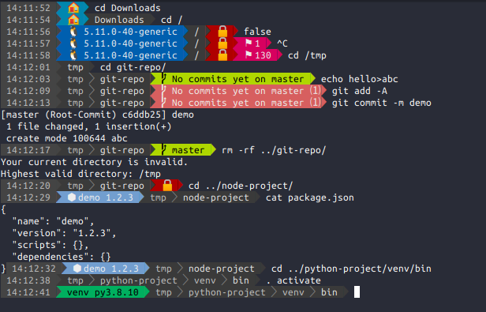

# PoLiGo

## PowerLine Go

A beautiful and useful prompt generator for **bash** shell

This project is highly inspired by https://github.com/b-ryan/powerline-shell

## Setup

```bash
sudo apt install fonts-powerline
```

Download binary from [releases](https://github.com/knrdl/poligo/releases) and place it into `/usr/local/bin/poligo`

Add the following to `~/.bashrc`:

```bash
function enable_poligo() {
    PS1="$(poligo --timeout=500ms cwd-exists warn-memory=75% term-title current-time go-version python-version nodejs-project docker-version kernel-version warn-offline shell-level virtual-env work-dir=4 sudo-root git read-only ssh-connection user-name=your_default_username exit-code=$?)"
}

function disable_poligo(){
    PS1='${debian_chroot:+($debian_chroot)}\[\033[1;34m\]\u@\h\[\033[00m\]:\[\033[01;33m\]\w\[\033[00m\]\$ '
    PROMPT_COMMAND=""
}

PROMPT_COMMAND="enable_poligo"
```

Open a new terminal and enjoy!

## Configuration

```
$ poligo
Usage of poligo: 
  -timeout duration
    	total execution timeout (default 1s)
  Segments: 
    cwd-exists: Check current working directory exists
    warn-memory=N%: Warn if more than N% of memory/swap are used
    term-title: Set terimal title
    current-time: Display current time
    go-version: Display installed go version, if any *.go files in current directory
    python-version: Display installed python version, if any *.py files in current directory
    nodejs-project: Display project title and version, if current directory contains package.json
    docker-version: Display installed docker version, if current directory contains a Dockerfile
    kernel-version: Display linux kernel version in /, /boot and /usr/src
    warn-offline: Warn if no network connection available
    shell-level: Display number of nested shells
    virtual-env: Notify about activated python virtual environment
    work-dir=N: Show current working directory, optional limit the output to N folders
    sudo-root: Warn if current terminal has root permissions via sudo
    git: Show git status, pushs, pulls, modified files and current branch
    read-only: Warn if current directory is read only
    ssh-connection: Warn if terminal is connected via ssh
    user-name=DEFAULT: Show username except when it equals DEFAULT
    exit-code=$?: Show if last command returned an error code (parameter must be $?)
```

## Screenshot


